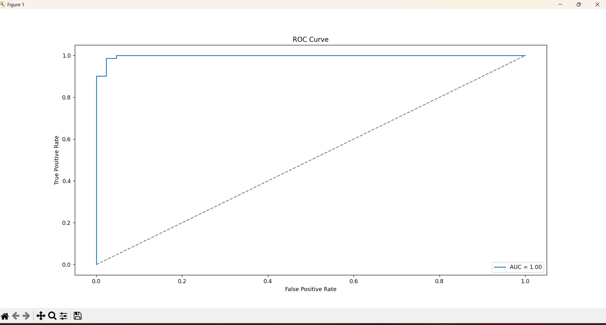

# Binary_Classification_task_4

---

# Task 4: Classification with Logistic Regression

## Detailed Steps Performed

### 1. Load Dataset

* Loaded the dataset from a CSV file named `data.csv`.
* The dataset contains multiple feature columns and a binary target column named `target`.
* Printed the dataset shape and first few rows to verify successful loading.

---

### 2. Split Features and Target

* Separated the dataset into features (`X`) and target labels (`y`).

---

### 3. Train-Test Split

* Split the dataset into training and testing sets using an 80:20 ratio with a fixed random state for reproducibility.

---

### 4. Feature Scaling

* Standardized the feature columns using `StandardScaler` to normalize the data for better model training.

---

### 5. Train Logistic Regression Model

* Created and trained a logistic regression model on the standardized training data.

---

### 6. Make Predictions

* Predicted class labels and class probabilities for the test dataset using the trained model.

---

### 7. Model Evaluation

#### a. Confusion Matrix

* Calculated the confusion matrix comparing true labels and predicted labels.
* Visualized the confusion matrix as a heatmap using Seaborn and saved it as `images/Confusion_Matrix.png`.

#### b. Classification Report

* Generated and printed a classification report containing precision, recall, F1-score, and accuracy metrics.

#### c. ROC Curve and AUC Score

* Computed the ROC-AUC score to evaluate model discrimination ability.
* Plotted the ROC curve showing the trade-off between true positive rate and false positive rate, and saved it as `images/ROC_Curve.png`.

---

### 8. Threshold Tuning

* Adjusted the classification threshold from 0.5 to 0.4.
* Recalculated the confusion matrix and classification report to observe the impact of threshold changes on model performance.

---

### 9. Sigmoid Function Visualization

* Defined the sigmoid function used in logistic regression to convert linear outputs to probabilities.
* Plotted the sigmoid curve and saved it as `images/Sigmoid_Function.png`.

---

## Output Images
Confusion Matrix

### ROC Curve  

### Sigmoid Function  

---

## How to Run

1. Place the dataset CSV file named `data.csv` in the project directory.
2. Run the logistic regression Python script.
3. View the printed evaluation metrics in the console.
4. Review the saved images in the `images` folder for visual insights into model performance.

---

